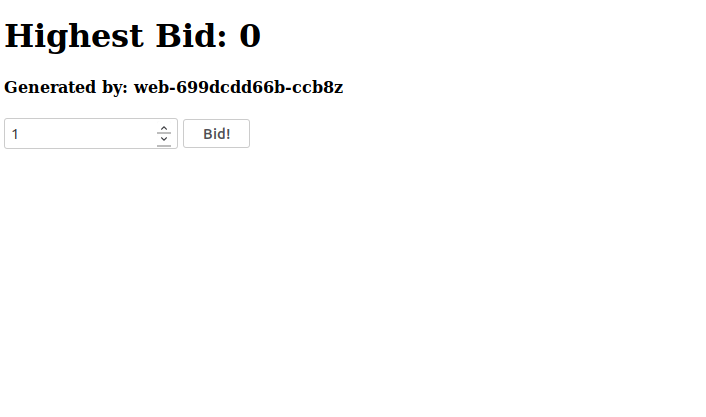

# 01 - Application Deployment

It's best to use a local Kubernetes cluser to do our experiments. You can use Minikube for this. Follow the [installation instructions](https://kubernetes.io/docs/tasks/tools/install-minikube/). After the installation you can start minikube:

`minikube start`

## 0. Connect to your cluster

Get some information about your cluster:

```bash
kubectl cluster-info
kubectl describe nodes
kubectl get pods -o wide -n kube-system
```

## 1. Create a Kubernetes Namespace

```bash
kubectl create ns cas
```

And now specify this namespace as the default:

```bash
kubectl config set-context $(kubectl config current-context) --namespace=cas
```

## 2. Deploy the webapplication

Now it's time to deploy our first service. Use the following yml to deploy nginx (Webserver) in your cluster (`kubectl apply -f web.yml`):

```yml
apiVersion: apps/v1
kind: Deployment
metadata:
  name: web
spec:
  selector:
    matchLabels:
      app: web
  template:
    metadata:
      labels:
        app: web
    spec:
      containers:
        - name: web
          image: nginx
```

Monitor the deployment of your webserver using the following command: `kubectl get pods -w`

## 3. Connect to your webserver

After the deployment is finished create another temporary pod to use as a bastion you can attach to. This way you have a shell inside a cluster and can experiment with your newly deployed service.

```bash
kubectl run my-shell --rm -it --image amouat/network-utils -- bash
```

Find out the cluster ip of your pod (execute this on your machine):

```bash
kubectl get pods -o wide
```

Execute on the connected bastion pod.

```bash
curl -i <podip>
```

## 4. Deploy our sampleapplication

After we saw our deployment worked let's deploy our sample application using the image `fluescher/cascld:latest`. To do that, take the YAML file of your first deployment and change the image name.

The application listens on port 80. Show the logs of the newly started pod using `kubectl logs <podname>`

To view the application in your browser, you can use port forwarding: `kubectl port-forward <podname> 8000:80` and then visit localhost:8000.

You should see this page:



## 5. (Bonus) Limit Resources

Limit the resources of the webapplication to 100MB of RAM and 100 Mili CPUs. You find an example here: https://kubernetes.io/docs/concepts/configuration/manage-compute-resources-container/#meaning-of-memory

## 6. (Bonus) Add Health Checks

Configure both a liveness check and a readyness probe for the webapplication. Use a TCP liveness probe https://kubernetes.io/docs/tasks/configure-pod-container/configure-liveness-readiness-probes/#define-a-tcp-liveness-probe and a HTTP readyness probe https://kubernetes.io/docs/tasks/configure-pod-container/configure-liveness-readiness-probes/#define-a-liveness-http-request

- What happens if you misconfigure the health check (by using a wrong port)?

## Questions

1. What IP was assigned to your newly created POD?
2. What is the subnet of this ip?
3. Can you ping it from your host?
4. Can you ping it from your bastion pod?
5. Are you able to connect to your application using port forwarding?

